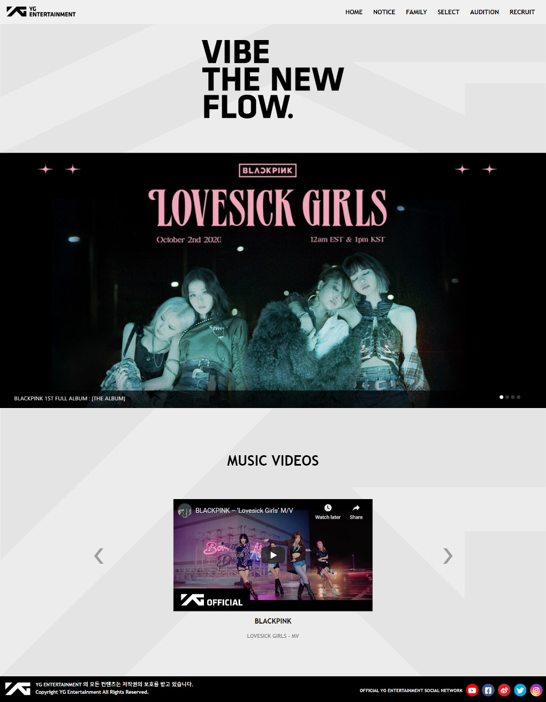
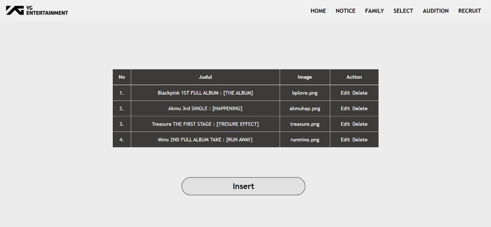
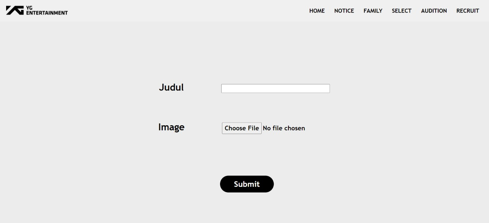

# Web Design course project
### This project is the final project of the Web Design course. The display on this website is designed using the Adobe XD application and implemented using HTML, CSS and Bootstrap 4.

 

# How To Install
### Install all files and open **index.html** using your browser.

 

# ScreenShot

